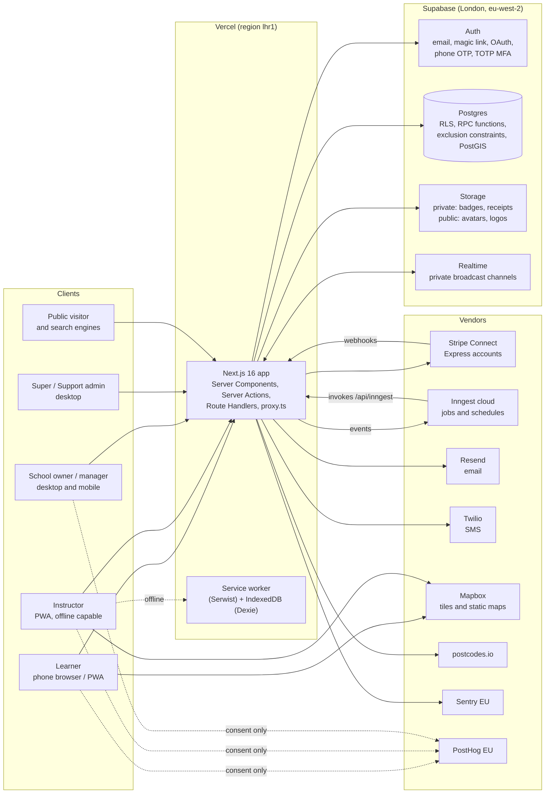
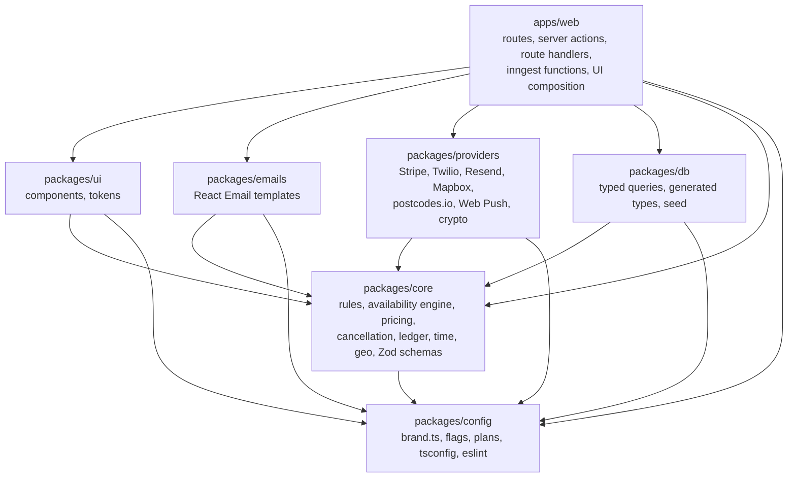
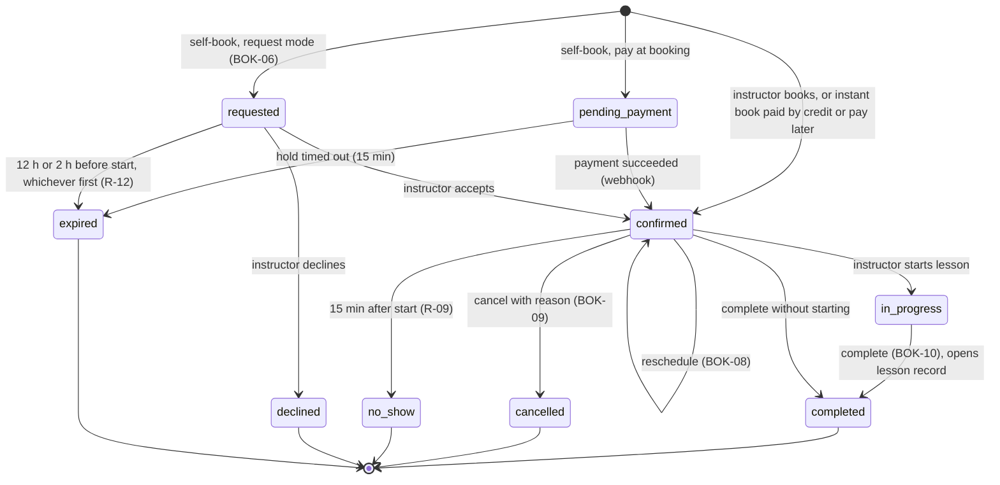
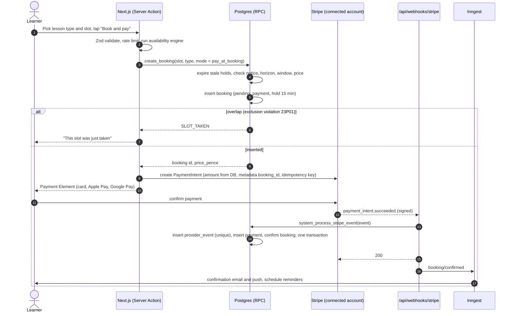
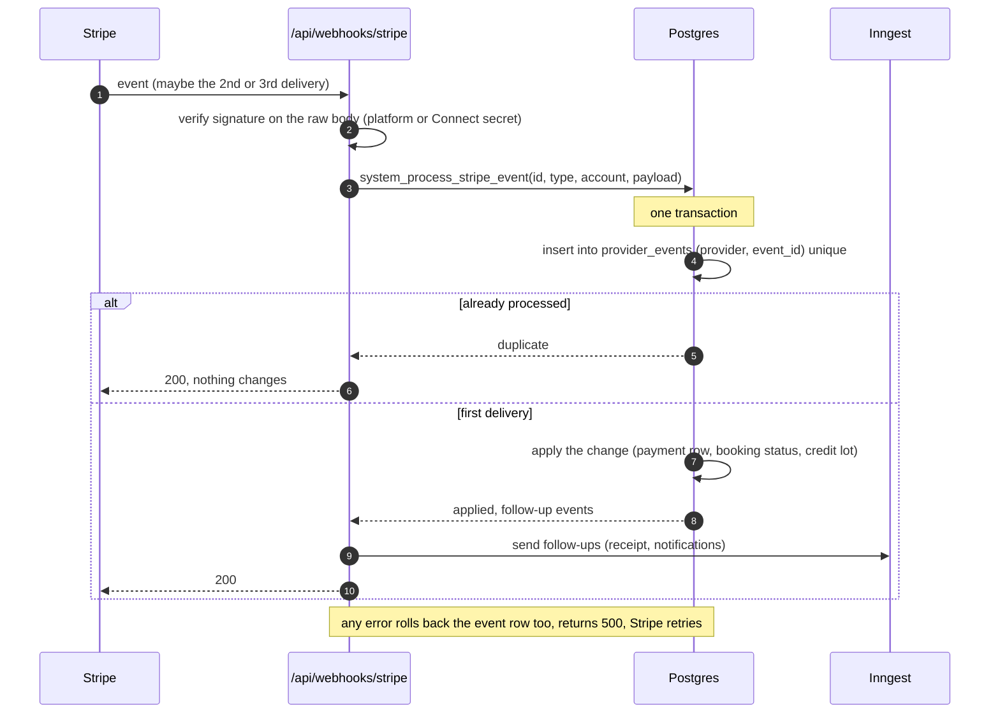
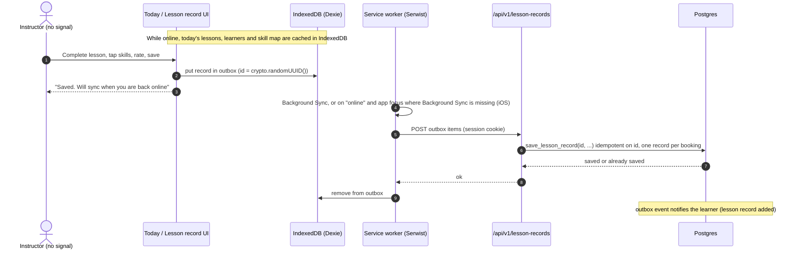

# Architecture

Status: Draft for approval | 11 September 2026 | Scope: Phase 1 (M0 to M6), shaped for Phases 2 to 5

This document explains how the system is built and why. Requirement IDs refer to `docs/Doovor_PRD.md`. Decision IDs (`D-001`) refer to `docs/DECISIONS.md`.

## 1. Guiding principles

1. **The database is the last line of defence.** Tenancy (RLS), double booking (exclusion constraints), money integrity (ledger constraints) and idempotency (unique keys) are enforced in Postgres, not only in TypeScript.
2. **Domain logic is pure and portable.** Rules live in `packages/core` with no framework imports, so a future Expo app (Phase 5) reuses them unchanged.
3. **Every vendor sits behind an interface.** Payments, SMS, email, maps, geocoding and push can be swapped or faked in tests.
4. **Marketplace-ready from day one.** Coverage, availability, prices and verification are stored in the shape Phase 3 search needs (section 4.1 of the PRD).
5. **Boring, observable operations.** One region (London), one database, one job runner, structured logs, idempotent handlers, forward-only migrations.

## 2. System context



There is one deployable web app. All server code runs on Vercel Node functions in London, next to the database. Background work runs as Inngest functions, which Inngest invokes over HTTPS through the app's `/api/inngest` route, so jobs share the same code, types and providers as the app.

## 3. Module boundaries



Dependency rules, enforced by ESLint import boundaries:

| Package | May import | Must not import | Notes |
|---|---|---|---|
| `config` | nothing internal | anything internal | Brand, flags, plan entitlements, shared tooling config |
| `core` | `config`, `zod`, `date-fns`, `@date-fns/tz` | React, Next.js, Supabase, Node built-ins | Pure functions. Runs in browser, Node, service worker and React Native |
| `db` | `core`, `config`, `@supabase/supabase-js` | Next.js, React | Query helpers take a `SupabaseClient` argument so they work on server, client and native. Server-only helpers live under `@repo/db/server` |
| `providers` | `core`, `config`, vendor SDKs | Next.js, React UI | Interfaces in `src/interfaces`, implementations per vendor, plus in-memory fakes for tests |
| `emails` | `core`, `config`, `react-email` | Next.js, Supabase | Pure templates, previewable with the React Email dev server |
| `ui` | `core`, `config`, React, Radix, Tailwind | Supabase, Next.js server APIs | Presentational components only. Data comes in through props |
| `apps/web` | everything | nothing | Composition root. The only place that wires sessions, providers and data together |

### 3.1 Brand as configuration

`packages/config/src/brand.ts` exports the name, short name, domain, support email, legal entity, social links and colour tokens. Everything else reads from it:

- `<BrandStyle />` (in `packages/ui`) writes the colours from `brand.ts` as `--brand-*` CSS variables in the page head. `packages/ui/src/styles/theme.css` maps Tailwind utilities to those variables with `@theme inline` and resets Tailwind's default palette, type scale, radii and shadows, so only PRD tokens exist. The repository holds each colour value once and needs no build step (D-005).
- Metadata, the web app manifest, Open Graph images, email templates, SMS copy and the seed script all import `brand`.
- A CI copy guard (`scripts/check-copy.mjs`) fails the build if the brand name appears in `apps/`, `packages/` or `supabase/` outside `brand.ts`, or if an em dash or en dash appears in UI, email or SMS source.
- Workspace packages use the neutral `@repo/*` scope.

## 4. Web application structure

### 4.1 Route map

| Area | Path | Rendering | Access |
|---|---|---|---|
| Marketing and SEO | `/`, `/learners`, `/instructors-software`, `/driving-schools-software`, `/pricing`, `/guides/{topic}` | Static, cached | Public |
| City and area pages | `/driving-lessons/{city}`, `/driving-lessons/{city}/{area}`, `/driving-lessons/{city}/automatic` | Cached (`use cache`, tagged), revalidated on data change | Public |
| Profiles | `/instructors/{city}/{slug}`, `/schools/{city}/{slug}` | Cached, tagged per profile | Public |
| Booking link | `/book/{slug}` | Dynamic (live slots) | Public, sign-in at checkout |
| Legal | `/legal/*` | Static | Public |
| Auth | `/sign-in`, `/sign-up`, `/start` (role choice, AUTH-03), `/auth/callback`, `/verify-phone`, `/mfa` | Dynamic | Public |
| Onboarding | `/onboarding/instructor/{step}`, `/onboarding/school/{step}`, `/onboarding/learner/{step}`, `/invite/{token}` | Dynamic | Signed in |
| Learner portal | `/app/learner/...` (Home, Lessons, Progress, Account, Payments) | Dynamic | Learner |
| Instructor portal | `/app/instructor/...` (Today, Diary, Learners, Money, More) | Dynamic, Today available offline | Instructor membership |
| School portal | `/app/school/...` (Overview, Diary, Instructors, Learners, Money, Settings) | Dynamic | Owner or manager membership |
| Admin | `/admin/...` | Dynamic, desktop layout | Platform staff with MFA (aal2) |
| API | `/api/webhooks/stripe`, `/api/inngest`, `/api/v1/...` (offline sync, receipts), `/api/health` | Route Handlers | Signed requests or session |
| Design system | `/design` | Dynamic | Development and preview only (404 in production) |

Portals live under `/app` so public SEO pages and the product never share a prefix. `/app/*` and `/admin/*` are `noindex` and disallowed in `robots.txt`.

### 4.2 Request pipeline

1. **`proxy.ts`** (Next 16 replacement for middleware) refreshes the Supabase session cookie using `@supabase/ssr`, tags the request with an ID, and redirects signed-out visitors away from `/app`, `/admin`, `/account`, `/mfa`, `/verify-phone` and `/onboarding`. It performs no authorisation: the portal gates (`requirePortal`) send people without the role to their own portal, and platform staff and school owners without an `aal2` session to `/mfa` (AUTH-08).
2. **Layouts** for each portal load the session with `supabase.auth.getClaims()` (local JWT verification) and the user's memberships through the database (`getAccess`), then pick the active Business (cookie `active_business`, validated against memberships). The database read is what catches a device signed out elsewhere (section 6.6). A user with several roles switches portal from the account menu.
3. **Server Components** read through the user's session client. RLS decides what rows exist for that user.
4. **Server Actions** validate input with the shared Zod schema, check the rate limit, call an RPC or a permitted table write with the session client, map domain error codes to copy and revalidate cache tags.
5. **Route Handlers** serve callers that are not a browser form: Stripe webhooks, Inngest, the service worker's background sync, and future native clients (`/api/v1`).

Mutation logic that needs server secrets (for example creating a Stripe PaymentIntent) lives in `apps/web/src/server/services/*`. Server Actions and `/api/v1` handlers both call these services, so a native app in Phase 5 needs routes, not rewrites.

### 4.3 Client state and live updates

- Server Components for first paint. TanStack Query for data that changes while a screen is open (diary, today view, booking status).
- **Realtime as an invalidation signal only.** Database triggers publish `{ table, id, action }` to private Realtime broadcast channels (`instructor:{id}`, `business:{id}`, `learner:{id}`). Channel access is controlled by RLS on `realtime.messages`. Clients react by invalidating the relevant TanStack Query keys and refetching through RLS. No row data travels over Realtime, so nothing can leak through a subscription.
- Optimistic updates for low-risk actions (mark paid, toggle working hours). Booking creation waits for the RPC because the database decides whether the slot is free. It still confirms in under a second.

## 5. Data model

The logical model follows PRD section 12. Conventions: UUID primary keys (`gen_random_uuid()`, or client-generated for offline writes), `created_at` and `updated_at` on every table (trigger-maintained), `timestamptz` in UTC, money as `integer` pence named `*_pence`, credit as integer minutes. Enumerations are Postgres enums, which can only grow, so later phases add values without rewrites.

### 5.1 Phase 1 tables by domain

| Domain | Tables | Notes |
|---|---|---|
| Identity | `users`, `platform_staff`, `learner_profiles`, `learner_private` | `users.id` equals `auth.users.id`, created by trigger on sign-up. `learner_private` holds date of birth and the encrypted licence number, readable only by the learner (R-16, NFR-PRV-04) |
| Tenancy | `businesses`, `memberships`, `invitations` | An independent instructor is a Business of type `independent` with one `owner` membership plus an instructor profile. Roles: `owner`, `manager`, `instructor`. `permissions` JSON is validated by a Zod schema in core |
| Instructor | `instructor_profiles`, `verification_submissions`, `coverage_areas`, `working_hours`, `availability_exceptions` | Profile carries base location (PostGIS `geography`), radius, buffer, instant book, public slug, listing flag and PDI supervisor link (R-18) |
| Geography | `postcodes`, `regions`, `region_interest`, `cities`, `city_areas` | `postcodes` is the postcodes.io cache. `regions` holds `marketplace_enabled` and thresholds per postcode area (MKT-10, ADM-04) |
| Learners | `learner_relationships`, `learner_notes`, `learner_assignments`, `pickup_points` | One relationship per learner per Business. Private notes live in `learner_notes`, a separate table with no learner policy (LRN-04). `learner_assignments` keeps allocation history (LRN-06) |
| Catalogue | `lesson_types`, `lesson_prices`, `packages` | Price per lesson type and duration (R-05). `lesson_prices.instructor_id` is null for the Business default and set for an instructor override (SCH-04) |
| Bookings | `bookings`, `booking_events`, `recurrences` | See section 7. `booking_events` records every status change with actor and reason |
| Money | `payments`, `refunds`, `credit_lots`, `credit_ledger`, `credit_accounts`, `billing_customers`, `provider_events` | See section 8 |
| Progress | `skills`, `lesson_records`, `skill_ratings`, view `skill_progress` | `skills` is reference data from PRD Appendix A. `lesson_records.id` is generated on the device so offline saves are idempotent. A record keeps its lesson's start (`lesson_starts_at`), which orders the timeline, and `skill_progress` rolls ratings up to each area's latest, as the reader (D-102) |
| Notifications | `notifications`, `notification_preferences`, `push_subscriptions`, `sms_usage` | `notifications.dedupe_key` is unique so a retried job never double-sends |
| Platform | `platform_settings`, `feature_flags`, `audit_log`, `impersonation_sessions`, `rate_limit_buckets`, `outbox_events`, `job_failures`, `deletion_requests`, `data_exports` | `audit_log` is append-only. `outbox_events` guarantees job delivery (section 9) |

### 5.2 Hooks for Phases 2 to 5

Phase 1 tables already carry the columns later phases need, so later work is additive:

| Later feature | Already in Phase 1 |
|---|---|
| Guardians and payers (AUTH-10, PAY-10) | `payments.payer_id`, a `payer` actor type in RPC permission checks |
| Gap Fill and waiting lists (GAP-01 to 05) | `bookings.source` includes `gap_fill`; `learner_relationships.status` includes `waiting`; cancellation emits a `booking/cancelled` event with the freed slot |
| Marketplace search (MKT-01 to 09) | PostGIS base location and radius, coverage districts, `is_listed`, verification and badge expiry, `regions.marketplace_enabled`, `bookings.source = marketplace`, `payments.fee_pence` for the capped fee |
| Driving Passport and transfers (PRG-04, LRN-07) | Lesson records belong to the learner (`learner_id`) and are readable by the learner across Businesses; `visibility` column for sharing rules |
| Test tracking (TST-01 to 04) | Encryption helper with key versioning ready for `booking_reference_encrypted`; `lesson_types.kind = test_day` |
| Fleet (BOK-11, SCH-06) | Nullable `bookings.vehicle_id` |
| Subscriptions and plans (ADM-10) | `businesses.plan`, entitlements in `packages/config/src/plans.ts`, Founding offer flag |
| Multi-branch and franchise (SCH-08, SCH-09) | `memberships.permissions` JSON and Business settings JSON allow a branch scope later without changing keys |

## 6. Security model and row-level security

### 6.1 Roles and actors

| Actor | How it is represented | Notes |
|---|---|---|
| Super Admin, Support Admin | Row in `platform_staff` | All staff access requires an `aal2` session (TOTP, AUTH-08) |
| School Owner, School Manager | `memberships.role` of `owner` or `manager` on a `school` Business | School owners must use TOTP. Managers never see billing or payouts (acceptance test 11) |
| Independent instructor | `owner` membership on an `independent` Business plus an instructor profile | TOTP optional (D-012) |
| School instructor | `instructor` membership on a `school` Business plus an instructor profile | Money visibility and price control come from `permissions` set by the school (SCH-02) |
| Learner | `learner_profiles` row, linked to Businesses through `learner_relationships` | Sees their own data across Businesses |
| Payer | Phase 2 | Designed in, not built |

### 6.2 Helper functions

All helpers live in a `private` schema that PostgREST does not expose, are `STABLE SECURITY DEFINER` with `set search_path = ''`, and read `auth.uid()` once.

| Helper | Returns |
|---|---|
| `private.auth_business_ids(roles role[] default null)` | Set of Business IDs where the caller has an active membership (optionally filtered by role). Used in policies as `business_id in (select private.auth_business_ids())`, which Postgres evaluates once per statement |
| `private.auth_is_member(business_id)` | True if the caller has an active membership in the Business |
| `private.auth_has_role(business_id, role[])` | True if the caller holds one of the roles |
| `private.auth_has_permission(business_id, permission)` | Resolves role defaults plus the membership `permissions` JSON (for example `view_revenue`, `set_prices`) |
| `private.auth_instructor_id(business_id)` | The caller's instructor profile ID in that Business, if any |
| `private.auth_is_staff(level)` | True for platform staff with an `aal2` session. `level` is `support` or `super` |
| `private.auth_can_see_learner(learner_id)` | True for the learner, staff of a Business with a relationship to them, and platform staff |
| `private.auth_taught_learner_ids()` | Set of learner IDs on the lessons the caller teaches, as an instructor with an active membership. Lets a lesson's instructor read who it is with, a cover lesson included, and nothing else about them (D-097) |
| `private.auth_can_book_learner(business_id, learner_id)` | True for somebody who manages bookings at the Business, for any of its learners, and for an instructor, for the learners assigned to them. `create_booking` and `book_weekly` check it before writing anything (PRD 6.2, D-097) |

### 6.3 Policy patterns

Every table gets one of five patterns. A pgTAP meta-test lists every table in `public` and fails if RLS is off or the table has no policy.

| Pattern | Example tables | Read | Write |
|---|---|---|---|
| **Tenant staff** | `lesson_types`, `packages`, `working_hours`, `coverage_areas`, `learner_notes` | Members of the Business (instructors limited to their own rows where relevant) and support staff | Direct writes allowed only where the permission matrix allows (for example `set_prices`) |
| **Learner-visible tenant data** | `bookings`, `payments`, `lesson_records`, `credit_accounts`, `learner_relationships` | Members of the Business (instructors see their own learners), plus the learner where `learner_id = (select auth.uid())` | No direct writes. Only RPCs |
| **Owned by user** | `users`, `learner_profiles`, `learner_private`, `pickup_points`, `notification_preferences`, `push_subscriptions` | Self; Business staff may read contact fields of learners they have a relationship with, and an instructor the `users` row of the learners on their lessons (never `learner_private`, D-097) | Self |
| **Public reference** | `skills`, `postcodes`, `cities`, `city_areas`, `regions` | Everyone | Staff or system only |
| **Platform and append-only** | `audit_log`, `platform_settings`, `provider_events`, `rate_limit_buckets` | Super Admin (support read for audit log) | Only `SECURITY DEFINER` functions. Update and delete are blocked by trigger |

### 6.4 Sensitive data separation

- **Private notes (LRN-04):** separate `learner_notes` table with no learner policy. Views are created `with (security_invoker = true)` and a pgTAP test asserts that every view in `public` has that option, so no view can widen access. RPCs that return learner cards list their columns explicitly and a test asserts the note text never appears in learner-facing output.
- **Date of birth (R-16):** stored only in `learner_private`. Instructors get `private.learner_age_band(learner_id)` which returns `under_18` or `18_plus` and nothing else.
- **Encrypted fields (NFR-SEC-04):** licence number now, test booking reference in Phase 2. Encrypted in application code with AES-256-GCM using Node's built-in crypto and a versioned key (`v1:` prefix, key ring in `FIELD_ENCRYPTION_KEYS`) so keys can rotate. Only the owning learner's server request decrypts. Instructors see "Licence number on file". This replaces pgsodium column encryption, which Supabase no longer recommends (D-010).
- **Public profiles:** anonymous visitors never read tables directly. `SECURITY DEFINER` functions (`get_public_instructor`, `list_public_instructors`, `get_public_busy_ranges`) return an explicit allowlist of fields, and busy ranges carry no learner data.

### 6.5 Write model

- **Direct table writes** (through RLS `with check`) for low-risk, single-row edits: profile fields, working hours, exceptions, lesson types, pickup points, preferences.
- **RPC only** for anything that touches money, time allocation, roles or verification: `create_booking`, `create_recurring_bookings`, `respond_to_request`, `reschedule_booking`, `cancel_booking`, `complete_booking`, `mark_no_show`, `record_offline_payment`, `issue_refund`, `invite_member`, `change_member_role`, `decide_verification`, `save_lesson_record`, `assign_learner`, `start_impersonation`. Each RPC:
  1. derives the actor from `auth.uid()`, never from parameters;
  2. checks permissions with the helpers above and the PRD permission matrix;
  3. recomputes prices, fees and ranges from database state, never trusting client values;
  4. runs every step in one transaction (R-10);
  5. writes `booking_events` and, for NFR-SEC-06 actions, `audit_log`;
  6. raises typed error codes (`SLOT_TAKEN`, `TOO_CLOSE`, `OUTSIDE_AVAILABILITY`, `INSUFFICIENT_CREDIT`, `NOT_ALLOWED`) that the app maps to copy.
- **System RPCs** (`system_*`) are executable only by the secret-key role and are used by the Stripe webhook and Inngest jobs. They are never called on behalf of a signed-in user.

### 6.6 Other controls

| Control | Approach |
|---|---|
| MFA (AUTH-08) | Supabase TOTP. `proxy.ts` forces enrolment and challenge for staff and school owners. Staff policies and billing RPCs also check `auth.jwt() ->> 'aal' = 'aal2'`, so the rule holds even if the UI is bypassed |
| Sessions (AUTH-09) | Device list from `auth.sessions` through a self-only function, sign out one device or all (`signOut({ scope: 'global' })`), deletion request creates a `deletion_requests` row processed in M6. Signing out takes effect at once: PostgREST runs `private.check_request` before every request and refuses tokens whose session has ended (401 `SESSION_ENDED`, D-041). Server-side auth calls forward the visitor's user agent and IP (D-042) |
| Rate limiting (NFR-SEC-03) | Supabase Auth's built-in limits for sign-in, OTP and email. A Postgres fixed-window limiter (`private.rate_limit_hit(key, window, max)`) behind a `RateLimiter` interface for booking, invite and messaging actions, keyed by user and IP (D-008) |
| Storage | Private buckets `badges` and `receipts` with path-scoped policies (`{business_id}/...`), signed URLs valid for 60 seconds. Public buckets `avatars` and `logos` for images that appear on public pages. Uploads are resized and stripped of EXIF location data in the browser before upload |
| Realtime | Private channels only. RLS on `realtime.messages` allows a subscription when the caller can see the channel's instructor, Business or learner |
| Headers | HSTS, `X-Content-Type-Options`, `Referrer-Policy: strict-origin-when-cross-origin`, `Permissions-Policy`, `frame-ancestors 'none'`. CSP in report-only mode from M0, enforced in M6 after the Stripe, Mapbox, Sentry and PostHog origins are verified |
| Impersonation (ADM-06) | "View as" mode: staff start a time-limited `impersonation_sessions` row with a reason (audited). The app renders the target user's portal using the staff member's own session, which already has read access, filtered to the target's scope. A yellow banner shows throughout. Every Server Action refuses to run while a view-as session is active, and no tokens are minted for the target user (D-014) |
| Audit (NFR-SEC-06) | Sign-in via a trigger on `auth.sessions` inserts; role changes via a trigger on `memberships`; verification, refunds, payout changes, exports, deletion and impersonation inside their RPCs. Rows record actor, role, before and after, IP and user agent |
| Secrets (NFR-SEC-02) | Only publishable values use `NEXT_PUBLIC_`. Server modules import `server-only`. Supabase publishable and secret keys replace the legacy anon and service role keys, which Supabase retires at the end of 2026 (D-006) |

## 7. Bookings

### 7.1 Time model (R-14)

- Instants (`starts_at`, `ends_at`, exceptions, expiries) are `timestamptz` in UTC.
- Working hours are local wall-clock times (`weekday`, `start_time`, `end_time`) interpreted in the Business time zone (default `Europe/London`).
- Conversion between local and UTC happens in one place per runtime: `packages/core/src/time` (using `@date-fns/tz`) and, inside the database, `AT TIME ZONE business.timezone`. Both are tested against the same clock-change fixtures.
- Clock change rules: a local time that does not exist (01:00 to 01:59 on the last Sunday of March) is never offered as a slot. A local time that happens twice (01:00 to 01:59 on the last Sunday of October) resolves to the first occurrence. A weekly recurring 09:00 lesson is generated in local time, so it stays at 09:00 London time across the change (acceptance test 9).

### 7.2 Double-booking protection (BOK-07, R-01 to R-03)

The PRD states two things that cannot both hold. R-01 says a booking blocks from start minus buffer to end plus buffer. If both bookings carry that padding, two lessons need a gap of twice the buffer. Acceptance test 1 requires a gap of exactly one buffer: with a 30 minute buffer and a 10:00 to 11:00 lesson, 11:30 must succeed. The acceptance test is the concrete product behaviour, so the buffer is applied once, after each lesson (D-001):

```
blocked_range = tstzrange(starts_at, ends_at + buffer, '[)')   -- instructor, buffered
learner_range = tstzrange(starts_at, ends_at, '[)')            -- learner, unbuffered (R-03)
```

Worked example (buffer 30): the existing lesson blocks `[10:00, 11:30)`. A request for 11:15 blocks `[11:15, 12:45)`, which overlaps, so it is rejected with "Too close to your 10:00 lesson". A request for 11:30 blocks `[11:30, 13:00)`, which touches but does not overlap, so it succeeds. A lesson before 10:00 must end by 09:30 because its own buffer runs to its end plus 30 minutes.

```sql
create extension if not exists btree_gist;

alter table bookings add constraint bookings_no_overlap
  exclude using gist (instructor_id with =, blocked_range with &&)
  where (status in ('pending_payment', 'requested', 'confirmed', 'in_progress', 'completed'));

alter table bookings add constraint bookings_learner_no_overlap
  exclude using gist (learner_id with =, learner_range with &&)
  where (status in ('pending_payment', 'requested', 'confirmed', 'in_progress', 'completed'));
```

- Both ranges are computed by a `BEFORE INSERT OR UPDATE` trigger from `starts_at`, `ends_at` and the booking's `buffer_minutes`, so no write path can set them wrongly. The buffer is copied from the instructor setting when the booking is made, so a later change to the setting never invalidates existing lessons.
- Blocking statuses extend the brief's list (D-002). `pending_payment` is a short checkout hold (15 minutes) so two learners cannot both pay for one slot. `completed` blocks because a finished lesson still occupied that time. `cancelled`, `no_show`, `declined` and `expired` never block (R-02).
- R-02 says requests block "while unexpired". A constraint cannot read the clock, so expiry is enforced two ways: an Inngest job flips the status at `expires_at`, and every booking RPC first expires stale requests and holds that overlap the new range, in the same transaction. A late job therefore can never block a slot.

### 7.3 Availability engine

`packages/core/src/availability` is a pure function:

```
getBookableSlots({ workingHours, exceptions, busyRanges, bufferMinutes, durationMinutes,
                   noticeMinutes, horizonDays, timeZone, now, stepMinutes, actor }) -> Slot[]
```

- Inputs are plain data, so the same engine runs on the server (booking link, public profile, instructor booking sheet), in the service worker (offline today view) and later in a native app.
- Self-booking rules (R-04): inside working hours or an `open` exception, outside `blocked` exceptions, after the minimum notice (default 24 hours) and inside the horizon (default 8 weeks). Instructor-created bookings may sit outside availability after a warning.
- The engine is for showing slots. The **database is the authority**: `create_booking` re-checks notice, horizon and availability windows in SQL for self-bookings, and the exclusion constraints decide overlaps. A future native client calling the RPC directly gets the same protection.
- Both implementations run the same JSON test vectors (`packages/core/test-vectors/availability/*.json`): Vitest runs them against the TypeScript engine and a pgTAP test runs them against the SQL checks. Clock-change cases are part of the vectors.

### 7.4 Booking lifecycle



Payment status is a separate field: `unpaid`, `pending`, `paid_card`, `paid_cash`, `paid_bank`, `paid_credit`, `refunded`, `partially_refunded`, `failed`. That keeps "is the time taken" apart from "is the lesson paid", which the diary colours need (DIA-04).

### 7.5 Flow: learner self-books and pays by card (BOK-02, PAY-02, R-10)



The browser shows the confirmation screen as soon as Stripe confirms, then polls the booking status (TanStack Query) until the webhook lands, normally within a second or two. If the hold expires before payment succeeds, a job cancels the PaymentIntent. If a payment still succeeds after the hold expired and the slot has gone, the webhook RPC refunds it automatically and tells the learner.

### 7.6 Flow: instructor books in three taps, paid by credit (BOK-01, PAY-04, R-10)

1. Pick learner (recent learners first). 2. Pick slot (engine output, duration defaults to the learner's usual length). 3. Confirm.

`create_booking` then, in one transaction: inserts the booking (the exclusion constraints decide overlaps, and its trigger takes the diary and learner locks), locks the learner's `credit_accounts` row (`FOR UPDATE`), and when the usable credit covers the whole lesson consumes lots oldest first as `credit_ledger` rows of type `use`, which move the cached balance (a `CHECK balance_minutes >= 0` makes overdraw impossible), and marks the lesson `paid_credit`. Any failure rolls back all of it. Credit that covers only part of a lesson is not used (D-088). With no credit and a pay-later or offline Business setting, the booking is confirmed as `unpaid`. A request is paid from credit when it is made and gets it back when it is declined or lapses; a trigger on the move to `expired` covers every path that notices a lapse.

### 7.7 Recurring lessons (BOK-05, R-13)

`create_recurring_bookings` expands the rule in local time into individual occurrences, tries each in its own savepoint, and returns which dates succeeded and which failed with the reason. The user sees the failed dates and accepts the rest. "Until cancelled" series are created up to the booking horizon, and a weekly job extends them, reporting any new clash to the instructor.

### 7.8 Cancellation, reschedule and no-show (BOK-08, BOK-09, R-06 to R-09)

The policy is a pure function in core, `cancellationOutcome({ startsAt, now, by, windowHours, lateFeePercent, pricePence, paidWith, creditMinutes, status })` in `packages/core/src/cancellation.ts`, returning `{ late, feePence, refundPence, creditReturnedMinutes, creditKeptMinutes, reasonRequired, paidWith }`. The warning before somebody presses cancel and the words in the notification afterwards (`cancelledMoneyWords`) come from the same file. Only a lesson that is on can be cancelled late: a request or a slot held for a card costs nothing to let go (D-092).

| Case | Outcome |
|---|---|
| Learner cancels outside the window (default 48 h) | Full refund to card, or full credit returned (R-07) |
| Learner cancels inside the window | Fee kept per policy (0, 50 or 100%). Credit covers the fee first (R-07). Email explains why (acceptance test 4) |
| Instructor or Business cancels | Reason required. Learner always gets a full refund or full credit (R-08, acceptance test 5) |
| No-show | Only allowed from 15 minutes after start. Settles its money as a late cancellation by the learner, and records `dispute_until`, 7 days on (R-09, D-093). The learner disputes from their lessons with `dispute_no_show`; an owner or manager waives the fee, giving back whatever paid it, or keeps it, with `decide_no_show_dispute` (D-094) |
| Learner reschedules | Only outside the cancellation window (BOK-08). Inside it, the learner sees the cancellation terms instead |
| Instructor reschedules | Any time. Learner notified |

`cancel_booking` applies the outcome in one transaction: the status change; credit given back less any fee (`give_back_credit`); money given back less the fee, oldest payment first (`settle_cancelled_payments`), where a card refund is sent to Stripe by the refund job and reconciled by webhook and cash or a bank transfer is owed back until somebody marks it handed back (`settle_offline_refund`); an audit row; and a `booking.cancelled` outbox event carrying the policy (window, percentage, minutes before the start) and what became of the money, from which the notification job writes the learner's explanation (acceptance test 4, D-092).

### 7.9 Error codes and copy (acceptance tests 1 and 2)

| Code | Raised when | Instructor sees | Learner sees |
|---|---|---|---|
| `TOO_CLOSE` | Pre-check finds a buffer overlap but no lesson overlap | "Too close to your 10:00 lesson" | "This time is not available" |
| `OVERLAP` | Pre-check finds a lesson overlap | "Clashes with your 10:00 lesson" | "This time is not available" |
| `SLOT_TAKEN` | The insert hits the exclusion constraint (a concurrent booking won) | "This slot was just taken" | "This slot was just taken" |
| `LEARNER_BUSY` | Learner range overlaps (R-03) | "Sam already has a lesson then" | "You already have a lesson then" |

The friendly pre-check runs inside the RPC for good messages. The constraint is what guarantees correctness under concurrency: when two learners book the same slot at the same moment, the second insert waits for the first to commit and then fails, so exactly one succeeds (acceptance test 2).

## 8. Payments and money

### 8.1 Stripe Connect model (PAY-01, PAY-12)

- Each Business connects a **Stripe Connect Express** account during onboarding. The platform never holds learner money.
- **Recommended charge type: direct charges on the connected account** (D-011, needs sign-off, see PRD section 20). The Business is the merchant of record, the learner's statement shows the Business, Stripe's card fees come out of the Business's balance (the PRD's pass-through on the Free plan) and refunds and disputes sit with the Business. `application_fee_amount` is 0 for a Business's own learners in Phase 1 and carries the capped marketplace fee in Phase 3.
- Customers and saved cards are created on the connected account, per Business and learner (`billing_customers`). A learner with two instructors saves a card with each. That matches "credit held against that Business only".
- Apple Pay and Google Pay through the Payment Element. The payment method domain is registered on each connected account when it is created.
- A card typed in goes into the Payment Element (`apps/web/src/components/payments/card-form.tsx`). It loads Stripe.js for the connected account (`stripeAccount`), draws the fields for the payment's or set-up's client secret, and confirms in the browser; the webhook records what happened. Checkout offers only methods that pay on the screen (card, Apple Pay, Google Pay and Link), with no redirects. The error words come from `apps/web/src/lib/payments/card-errors.ts`. When a kept card needs the bank's check, the charge answers with its client secret and the screen runs `handleNextAction` (D-099). The Permissions-Policy header lets Stripe's frame use the Payment Request API, and the report-only CSP lists Stripe's script and frame origins.
- Everything goes through `PaymentsProvider` (`createCheckoutIntent`, `captureHold`, `cancelHold`, `chargeSavedMethod`, `refund`, `createAccountLink`, `verifyWebhook`). Tests use an in-memory fake. Acceptance tests 3 to 6 also run against Stripe test mode.

### 8.2 Payment modes (PAY-03)

| Business setting | Flow |
|---|---|
| Pay at booking (default) | `pending_payment` hold, PaymentIntent, webhook confirms (section 7.5). Request-to-book bookings use a manual-capture authorisation that is captured on accept and released on decline or expiry (R-12) |
| Pay before lesson | Booking confirmed as `unpaid`. An Inngest job charges the saved card off-session 24 hours before the start. If the bank asks for authentication, the learner gets a payment link and the instructor sees "Payment failed" |
| Pay after lesson | Completing the lesson triggers a payment link (hosted page with the Payment Element) by email and push |
| Credit | Any mode uses available credit first (PAY-04) |
| Offline | Instructor records cash or bank transfer in two taps (PAY-05). Shows "Paid (cash)" or "Paid (bank)" |

### 8.3 Credit: lots, ledger and balance (PAY-04, PAY-06, R-07)

Credit is time (minutes) bought as a package from one Business. Three tables keep it correct:

- `credit_lots`: one row per package purchase (or credit given) with `minutes_total`, `minutes_remaining`, `price_pence` and `expires_at`, and the `payment_id` that bought it, unique. Lots are consumed oldest first. Lots let expiry (package `expiry_days`) and refunds of unused credit value each purchase correctly: a refund is worth `floor(price_pence * minutes_remaining / minutes_total)`, all integer arithmetic (`packages/core/src/credit.ts`). A lot starts empty and its first ledger row fills it; what it was bought as never changes.
- `credit_ledger`: append-only record of every movement (`purchase`, `use`, `return`, `fee`, `expiry`, `adjustment`, `refund`) with signed minutes, lot, booking, payment, refund, actor and reason. Checks tie each kind to its direction and to what it must point at (a lesson for `use`, `return` and `fee`; a person and a reason for `adjustment`). Update, delete and truncate are blocked by trigger.
- `credit_accounts`: cached balance per Business and learner, `CHECK (balance_minutes >= 0)`, locked with `FOR UPDATE` by the functions that move credit. An account exists only for a learner the Business has a relationship with (PAY-12).

Inserting a ledger row moves its account and then its lot, by trigger, in the same statement, and a guard refuses any other change to either number (D-085). The balance is therefore the sum of the ledger by construction; a pgTAP test checks it after hundreds of random moves, some of them refused. Nothing a ledger row points at is deleted by cascade, so the money history outlives the people in it (NFR-PRV-03).

Acceptance test 3: 120 minutes of credit, book 60, the balance shows 60, cancel 72 hours before, one `return` row brings it back to 120.

A learner's balance with a Business (PAY-06) is read by one function, `learner_balance`, which checks the caller (the learner, owners and managers, the learner's instructor, staff) and returns all the facts: usable credit, the lessons that could be owed for, lessons called off late whose fee nobody has paid, and recent payments (with anything on its way back against them), refunds (with the lesson they were for) and credit moves. `packages/core/src/balance.ts` decides what is owed, from when, and what is overdue (48 hours), and the learner's Payments screen and the instructor's learner card render that one result (D-090).

### 8.4 Webhooks, processed exactly once (R-11)



- Recording the event and applying it happen in the same transaction, so a crash can never mark an event processed without its effect.
- Concurrent duplicate deliveries serialise on the unique index. Defence in depth: `payments.provider_ref` and `credit_lots.payment_id` are unique too. Acceptance test 6 replays one package payment three times and asserts one payment and one credit entry, in pgTAP and through the route.
- An event about a lesson, payment or package is applied only when it comes from that Business's own connected account (D-087).
- A package payment carries what it buys in its metadata (package, learner, minutes, days), written by the server when the payment starts. The webhook writes the payment, the lot and its `purchase` row together (`system_record_package_payment`, D-086).
- Follow-up work (emails, push, analytics) runs in Inngest with its own idempotency keys, so the webhook responds fast.

### 8.5 Refunds, fees and receipts

- **Refunds (PAY-07):** `issue_refund` records the refund (full or partial, back the way it was paid or as credit) with reason and actor, and writes an audit row. Card refunds are sent to Stripe by a job with an idempotency key and the refund's own id in its metadata, and are settled from Stripe's answer and from the `refund.created`, `refund.updated` and `refund.failed` events, which also record refunds made in the Stripe dashboard. Cash and bank refunds issued by hand are settled when written down; those a cancellation makes are owed back until marked handed back (D-092). Unused credit is refunded by the minute at its lot's price and leaves the balance at once, coming back if the refund fails. A lesson's payment status is worked out again from all its payments after any refund. Only owners, managers and staff can refund, not school instructors (D-091).
- **Late cancellation and no-show fees (PAY-09):** credit is used first (R-07). Otherwise the fee is kept from what was paid, oldest payment first, and the rest goes back: to the card through the refund job, or owed back in cash or by transfer (D-092). For an unpaid booking the fee is charged by the fee job to the card the learner keeps with the Business, with nobody there, at a Business that takes cards and does not take payment in person. Without a card, or when the charge fails, the fee is owed (PAY-06, shown in red when overdue) and is paid on the pay screen or in person. A no-show settles the same way (D-093).
- **Receipts (PAY-08):** `system_issue_receipt` issues a receipt when a payment is received: the next number for its Business from `private.receipt_counters`, and what it says frozen on the row (name, address, VAT number, what was paid for, amount, method). VAT shows only when the Business has a VAT number, as the VAT included in the price at 20%. The `receipt-send` job emails it once (React Email, `packages/emails/src/receipt.tsx`) and the printable page is `/receipts/{payment}`. Cash and bank payments wait out their ten-minute undo window first (D-089). The words come from `packages/core/src/receipts.ts` for both the email and the page (D-095).

### 8.6 Money dashboard (MNY-01)

Aggregates this week, this month and this UK tax year (6 April to 5 April), with each period's days worked out in London in `packages/core/src/money-periods.ts`: paid by method, unpaid, credit sold and refunds. One `security definer` function, `money_summary`, reads `payments`, `refunds`, `credit_lots` and `bookings` after checking the caller. School instructors see only their own lessons, with no credit sold, unless the school allows more, which is MNY-06 (D-096).

## 9. Background jobs (Inngest)

Jobs are Inngest functions in `apps/web/src/jobs`, served from `/api/inngest`. Events carry IDs only, never personal data, so nothing sensitive is stored outside the UK or EU. Every job re-reads current state before acting, so a delayed or repeated run is harmless.

| Job | Trigger | What it does | PRD |
|---|---|---|---|
| `booking.reminders` | Cron, every 5 minutes | Asks which lessons are close, works out which reminders are due (24 h and 2 h by default, per Business settings) and writes them. The lesson's version is in the key, so a lesson that moved is reminded about at its new time only (D-075) | NTF-02 |
| `booking.request-expiry` | `booking/requested` | Sleeps until `expires_at` (12 h or 2 h before start, whichever first), calls `system_expire_request`, releases any authorisation | BOK-06, R-12 |
| `booking.hold-expiry` | `booking/held` | Expires unpaid checkout holds after 15 minutes and cancels the PaymentIntent | R-10 |
| `booking.expiry-sweep` | Cron, every 5 minutes | Safety net for requests and holds whose timers were missed | R-02, R-12 |
| `recurrence.extend` | Cron, weekly | Extends open-ended weekly series to the horizon and reports clashes | BOK-05, R-13 |
| `payment.auto-charge` | `booking/confirmed` with "pay before lesson" | Sleeps until 24 h before, charges the saved card off-session, handles authentication-required failures | PAY-03 |
| `payment.link-after-lesson` | `booking/completed` with "pay after lesson" | Sends the payment link | PAY-03 |
| `payment.refund` | `refund/requested` | Sends the refund to Stripe with an idempotency key | PAY-07 |
| `receipt-send` | `payment.received` | Issues the receipt, sleeping first for money recorded in person until its undo window has passed, and emails it under the key `receipt:{id}` | PAY-08 |
| `fee-charge` | `payment.fee_charge` | Charges a late cancellation or no-show fee nothing has paid to the learner's kept card, with nobody there, under the key `fee:{booking}:{amount}`. A refused, expired or authentication-required card is recorded, which tells both sides; no card leaves the fee owed (D-093) | PAY-09 |
| `payment-received-notices` | `payment.received` | Tells the learner (in the app and by push, since the receipt is their email) and the instructor, but not whoever marked cash paid. Money recorded in person waits out its undo window first (D-098) | NTF-03 |
| `payment-overdue-sweep` | Cron, daily at 10:00 London | Tells the learner, the instructor and the school once about each lesson or fee still owed two days after it was due, looking back 30 days. A lesson booked to be paid in person asks the instructor to mark it paid rather than chasing the learner | NTF-03, PAY-06 |
| `credit-low-notices` | `credit.low`, written when using credit leaves 2 hours or less | Tells the learner and their instructor what is left, once for each package bought | NTF-03 |
| `daily-payment-summaries` | Cron, daily at 08:00 London | One summary of the day before for the owners and managers of each school that took money | NTF-03 |
| `credit.expiry` | Cron, daily | Expires lots past `expires_at` with ledger rows | PAY-04 |
| `badge.expiry` | Cron, daily at 08:00 London | Reminders at 60, 30 and 7 days, deduplicated by threshold. Expired badges drop out of search automatically because listing checks the date | INS-03 |
| `booking.notices` | `booking.created`, `.accepted`, `.declined`, `.cancelled`, `.no_show`, `.disputed`, `.dispute_decided`, `.rescheduled`, `.completed`, `payment.charge_failed` | Reads who the lesson concerns, applies the catalogue and their settings, and writes one notification each | NTF-01, NTF-03, NTF-04 |
| `notification.dispatch` | Notifications not yet sent | Fans out to push, email and SMS on the channels the notification already carries (SMS on Pro, capped at 200 a month) | NTF-01 to 04 |
| `ledger.reconcile` | Cron, nightly | Asserts cached balances equal ledger sums and alerts on drift | PAY-04 |
| `account.deletion` | `account/deletion-requested` | Exports, anonymises and deletes per the retention rules (M6) | NFR-PRV-03 |
| `maintenance.cleanup` | Cron, daily | Clears old rate-limit buckets, stale holds and expired invitations | NFR-SEC-03 |

Retries use exponential backoff. Each function has an `onFailure` handler that reports to Sentry and records a row in `job_failures`, which admins can see: that is the dead-letter queue (PRD 14.5). The Inngest dev server runs locally with `pnpm dev` and needs no Docker.

**Transactional outbox:** RPCs never call Inngest directly. They insert into `outbox_events` in the same transaction, and a small dispatcher (called right after the RPC returns, plus a one-minute cron sweep) sends pending rows to Inngest and marks them sent. If the app crashes between the database commit and the send, the event is still delivered.

## 10. Notifications (NTF-01 to NTF-04, Appendix B)

- The notification catalogue from PRD Appendix B lives in `packages/core/src/notifications/catalogue.ts`: event type, audiences, channels, whether it is essential, and copy keys.
- `notifications` rows are the in-app inbox and the delivery log. `dedupe_key` (`{kind}:{entity}:{version}:{user}`) is unique, so retries never double-send.
- Which channels a notification uses is decided when it is planned, in `packages/core/src/notifications/plan.ts`, and stored on the row (D-072). The job that sends it reads the row rather than working the rule out a second time.
- Preferences (NTF-04): users switch non-essential notifications per channel. Essential service messages (booking confirmations, changes, cancellations, receipts, payment failures, security) always go by at least one channel (PECR allows service messages without consent, NFR-PRV-05).
- Channels: email (Resend, React Email templates), web push (VAPID, `push_subscriptions`, works on iOS for installed PWAs), SMS (Twilio, reminders only, Pro plan). All copy uses plain British English and never uses em or en dashes. A unit test scans every template's rendered output for them.
- Local and test environments use provider fakes that write to a local mailbox viewer and the console. Nothing real is sent outside staging and production.

## 11. Offline and PWA (PRG-09, PRD 8.1)



- Serwist with `@serwist/turbopack`, which compiles the service worker through a route handler and works with the Turbopack build that Next 16 uses by default. The spike passed in M2 (D-073): the worker is written in `apps/web/src/app/sw.ts`, compiled by the route at `/serwist/[path]` and served from `/sw.js` through a rewrite so its scope is the whole app. Since M4-08 it is registered on every portal page once the page has loaded, and precaches nothing from the build (D-104).
- Kept on the device: Today and a lesson's screen, network first with a four second wait, each time one opens with signal (the first page a device opens is kept as soon as the worker runs), and the build files they are drawn with. Any other screen gets a plain page saying there is no connection. Kept screens are deleted when the sign in page opens. Today's and tomorrow's lessons are kept in IndexedDB (Dexie, database `kept-teaching`), read from `GET /api/v1/instructor/lessons` when the instructor portal opens, the signal returns or the app is looked at again, and replaced whole by each good read (D-105). With no signal, Today draws its lessons from that copy by the phone's clock under a banner. A lesson with no kept screen opens on `/app/instructor/lessons/offline?lesson=<id>`, which draws it from the copy, and the installed app's `/start` opens Today. Kept screens keep the build files they name (D-106). Public pages are not cached by the service worker (D-104).
- The outbox is per device. Saving is idempotent on the client-generated ID, so a retry never creates a second record. If a record already exists for the booking from another device, the server keeps the first and returns a conflict that the UI shows.
- Acceptance test 8 runs in Playwright with `context.setOffline(true)`, saves a record, goes back online and checks the learner's timeline.

## 12. Public profiles and SEO (PUB-01 to 04, PRD 8.3 and 14.6)

- Public pages are Server Components cached with `use cache` and tagged (`instructor:{id}`, `city:{slug}`). A profile edit, a verification decision or a new booking calls `revalidateTag`, so pages stay fresh without rendering on every request. Next-slot lists are rendered live on `/book/{slug}` and cached for 5 minutes on profile pages.
- Data comes from allowlisted `SECURITY DEFINER` functions (section 6.4). Listing rules: R-15 for search (Phase 3); in Phase 1 an expired badge or hidden profile shows "Not taking new bookings" and drops out of city pages and sitemaps (acceptance test 10, PUB-04).
- City and area URLs come from the `cities` and `city_areas` tables, which map postcode districts to places. Area pages with fewer than 3 verified instructors render with `noindex` (PRD 8.3).
- Structured data: `Person` plus `Service` and `Offer` for instructors, `LocalBusiness` (with `DrivingSchool`) for schools, `BreadcrumbList` on city and area pages, `AggregateRating` only when real reviews exist (Phase 2). Sitemaps are split by type (instructors, schools, cities, areas, guides) under one index. Open Graph images are generated per profile with `next/og`.
- QR codes and share buttons (WhatsApp, Instagram, copy link) on the instructor's "Share your booking link" screen (PUB-03).
- Lighthouse target 90 or higher (NFR-PERF-04): public pages use a static Mapbox image for the coverage map, not the interactive map, and ship no client JavaScript beyond small islands.

## 13. Maps and geography (COV-01 to 04)

- `GeoProvider` (postcodes.io): normalise, validate, look up single and bulk postcodes, reverse geocode. Results are cached in `postcodes` with a refresh after 180 days. Postcode normalisation and outcode parsing are pure functions in core.
- PostGIS stores instructor base points and learner locations as `geography(Point)`. Coverage checks use `ST_DWithin(base, point, radius)` with a GiST index, plus district include and exclude lists (COV-02). This is the query the Phase 3 marketplace needs at 20,000 instructors (NFR-PERF-03).
- `MapProvider` (Mapbox GL JS): loaded only on screens that need an interactive map (coverage editor, learner home), with a monochrome style. Until a custom Mapbox Studio style exists, the light base style is recoloured in code.
- A haversine distance function in core covers client-side needs (sorting pickup points, radius previews) and is unit-tested against PostGIS results.

## 14. Design system

- Tokens exactly as PRD 7.2 and the brief, generated from `brand.ts` into Tailwind 4 `@theme` variables. Spacing on an 8 point grid, 12 px radius for cards and sheets, 8 px for inputs, pill buttons and chips. Inter via `next/font` (self-hosted, no third-party request). Tabular figures for prices and times.
- Components are shadcn/ui (Radix primitives) restyled, plus Vaul for bottom sheets and Sonner for toasts. Everything listed in PRD 7.4 appears on `/design` with every state.
- Dark mode is a token switch prepared from the start, shipped later (PRD 7.2).
- **Contrast decisions (D-009)**, measured against WCAG 2.2 AA:

| Pair | Ratio | Rule |
|---|---|---|
| ink on white | 17.4:1 | Body text |
| grey-700 on white / on grey-100 | 7.6:1 / 6.8:1 | Secondary text **and placeholders** |
| grey-400 on white | 2.2:1 | Fails for text. Disabled states and decorative icons only (the PRD's placeholder use would fail AA) |
| black on yellow | 14.7:1 | Yellow always carries black text. Yellow on white is 1.4:1, so a selected slot also gets a black border and a tick |
| red on white / on grey-100 | 4.8:1 / 4.4:1 | Error text only on white. Inputs in an error state get a red border and the message sits below the field on white |
| blue on white / on grey-100 | 4.6:1 / 4.1:1 | Links only on white |
| green on white | 3.3:1 | Fails for small text. "Paid" and "Completed" pills are a green fill with black text (6.4:1) |
| grey-200 on white | 1.3:1 | Dividers only. Input boundaries use grey-700 so fields meet the 3:1 non-text rule |

## 15. Observability and analytics

- **Sentry** (EU region) for errors and performance on client, server and jobs, with a tunnel route so ad blockers do not drop events. Personal data is scrubbed before sending.
- **Structured logs**: JSON logs with request ID, user ID (never email), Business ID and duration. Health check at `/api/health` (database and job runner reachable) for uptime monitoring with phone alerts.
- **PostHog EU**: loaded only after the visitor accepts analytics cookies (NFR-PRV-02). Server-side events are sent only for users whose stored consent allows it. Event names and properties match PRD section 16 exactly and are typed in `packages/core/src/analytics/events.ts`.

## 16. Environments, CI and delivery

| Environment | Web | Database | Jobs | Payments and messaging |
|---|---|---|---|---|
| Local | `next dev` (Turbopack) | Supabase CLI stack in Docker, seeded | Inngest dev server | Provider fakes, Stripe test mode when keys exist, Supabase test OTP |
| CI | Production build | Supabase CLI in the GitHub runner, migrations and seed | Inngest test helpers | Fakes, plus Stripe test mode for payment acceptance tests |
| Preview (per PR) | Vercel preview | Shared staging project, or Supabase branching if approved (question 3) | Inngest branch environment | Test and sandbox keys |
| Production | Vercel, `lhr1` | Supabase production project, London, daily backups plus point-in-time recovery | Inngest production | Live keys |

**CI (GitHub Actions, every pull request):** install with a pnpm cache, then run in parallel: `lint` (ESLint and copy guards), `typecheck`, `unit` (Vitest with the 90% core coverage gate), `db` (start Supabase, apply migrations, run pgTAP), `integration` (Server Actions and Route Handlers against local Supabase), `e2e` (build, seed, Playwright at 390 and 1440 px with axe, screenshots uploaded as artefacts). Merges to `main` apply migrations to staging, then production after a manual approval step. Migrations are forward only; a mistake is fixed by a follow-up migration (PRD 14.5).

## 17. Testing strategy

| Layer | Tool | What is covered |
|---|---|---|
| Domain | Vitest | Availability engine, buffers and overlap, clock changes, cancellation policy, fees, ledger maths, pricing, postcode normalisation, distance, tax year. 90% line coverage gate |
| Database | pgTAP via `supabase test db` | Every RLS policy (as learner, instructor, manager, owner, other tenant, anonymous), every constraint, every RPC including failure paths, the RLS meta-tests, the availability test vectors |
| Integration | Vitest against local Supabase | Every Server Action and Route Handler, including webhook signature failures, duplicate events and rate limits |
| End to end | Playwright plus axe | PRD section 10 flows and all 12 acceptance tests at 390 px (touch) and 1440 px, screenshots reviewed each milestone |
| Load | k6 | Availability and booking endpoints against NFR-PERF-02 (p95 reads under 300 ms, booking writes under 600 ms) in M6 |

Each PRD acceptance test has a test named `acceptance-01` to `acceptance-12`, and the milestone reports list them.

## 18. Performance budget

- Public pages: LCP under 2.0 s on 4G, INP under 200 ms (NFR-PERF-01). Static rendering, no interactive map, image sizes set, fonts self-hosted.
- App reads: indexed RLS policies (`business_id`, `instructor_id`, `learner_id` on every table), set-returning helpers evaluated once per statement, and `(select auth.uid())` wrapping.
- Booking writes: one RPC round trip. The GiST exclusion index also serves the overlap pre-check.

## 19. Key risks and mitigations

| Risk | Mitigation |
|---|---|
| TypeScript 7 is the latest release but typescript-eslint does not support it yet | Pin TypeScript 6.0.x (D-003). Revisit when typescript-eslint supports 7 |
| Vitest 5 and pnpm 12 are new majors | Pin exact versions. If a blocker appears, drop one major and log it |
| Serwist and Turbopack integration | Spike when the service worker first lands (M2, web push), webpack build fallback (D-013) |
| Stripe charge model not yet signed off | Direct charges behind `PaymentsProvider`. Switching to destination charges changes the provider, not the domain (D-011) |
| Local database needs Docker, which is not installed on this machine | Question 1. Core logic, UI and design system work do not need the database, so work continues while it is set up |
| Webhook or job delivery gaps | Idempotent handlers, sweeps, reconciliation job, alerts |

